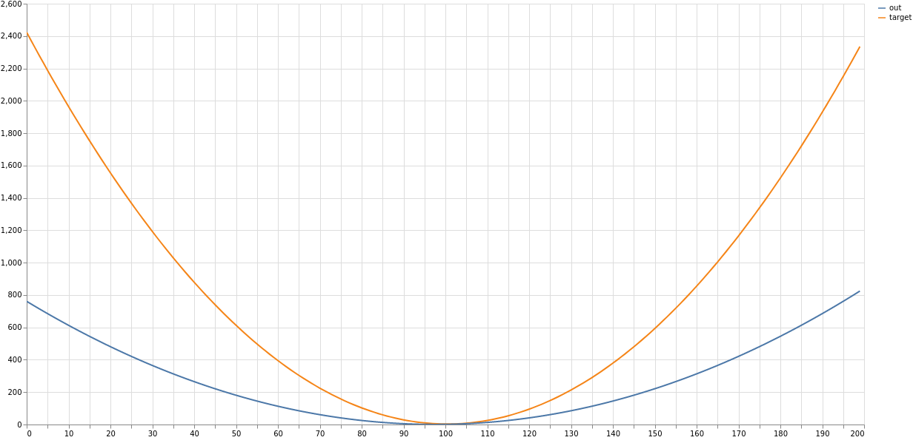

# toy-xp-versioning
Toy example repo of experiment versioning

## Requirements

- git: see installation instructions [here](https://git-scm.com/book/en/v2/Getting-Started-Installing-Git)
- conda: see installation instructions [here](https://docs.conda.io/en/latest/miniconda.html) 


## Installation

- Clone the repo :
```
git clone https://github.com/quentinf00/toy-xp-versioning.git
cd toy-xp-versioning
```

- Create the conda environment to run the project

```
conda env create -f env.yaml
```

- activate the conda environment :

```
conda activate toy-xp-versioning
```

- export cloud credentials (Ask Quentin for them):
```
export AWS_ACCESS_KEY_ID=XXXXXXXX
export AWS_SECRET_ACCESS_KEY=XXXXXXXX
```

- fetch the data from the cloud :
```
dvc pull
dvc checkout
```

## Presentation:

- This project aims to illustrate an experiment versioning workflow using git and dvc

- Experiment description : Find the parameters a, b and c that minimize the mean squared error of a function f wrt a target


- Directory structure :
```

## Core project files
### Source code
xp.py       ## ONLY FILE TO BE EDITED ## script defining function f and writing output files

## Data files
squared_err.metric ## last experiment score versionned with git 
target.npy.dvc ## dvc file of the target to match versionned with git
(target.npy) ## Actual file of the target to match versioned by dvc and ignored by git 
out.npy.dvc ## dvc file of the experiment output versionned with git
(out.npy) ## Actual file of the target to match versioned by dvc and ignored by git


## Project administration files
README.md   ## project description
env.yaml    ## conda environment definition
.dvc/       ## dvc folder (.git equivalent) contains dvc cache where big files are stored and synced wiht the cloud, and remote config
.gitgnore   ## files and folders to be ignored by git versioning 
.dvcgnore   ## files and folders to be ignored by dvc versioning 


## %% Others
sandbox/   ## folder with utils to visualize the different expériments
.idea/     ## ide configuration (can be ignored)
``` 


## Run an experiment

- Switch to a new git branch (you can put your name instead of `$(whomai)`):
```
git checkout -b $(whoami)
```

- make sure you are up to date :
```
dvc status # should return something like "All pipelines are up to date"
git status # should return something like "Working tree is clean"
```

- in the file `xp.py`  change the values of the parameters on line 7,8,9
- run the script :

```
python xp.py
```

- it will have generated/updated two files :
```
- out.npy 
- squared_err.metric 
```

(**NB:** 
1) run `dvc status` to see that `out.npy` has changed 
1) run `git status` to see that `xp.py` and `squared_err.metric` have changed 
)

- Version the experiment :

1) commit the new data
```dvc commit```
1) commit the code and dvc files 
```git commit -am "My experiment"```
1) upload your data files 
```dvc push```
1) upload your code 
```git push origin $(git branch --show-current)```

(run `git status` to see that `out.npy.dvc` has been updated)

## Compare different experiments :

- load all experiments in sandbox

```
bash ./sandbox/load_all_xp_results
```

- start the viz :

```
streamlit run sandbox/plot_xp.py 
```
